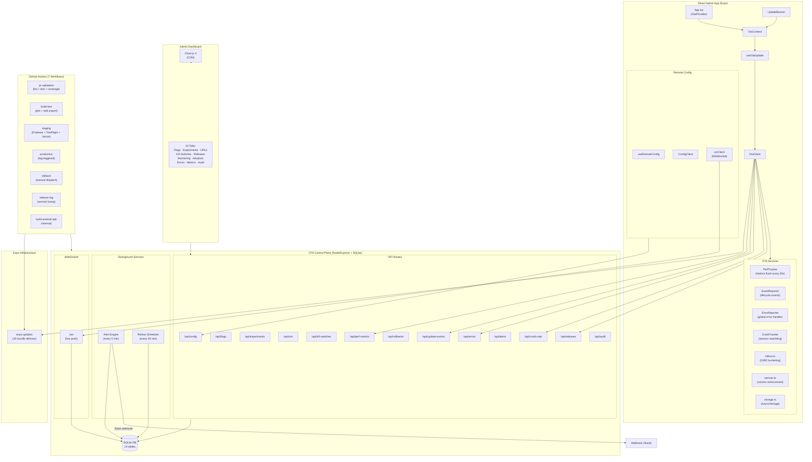
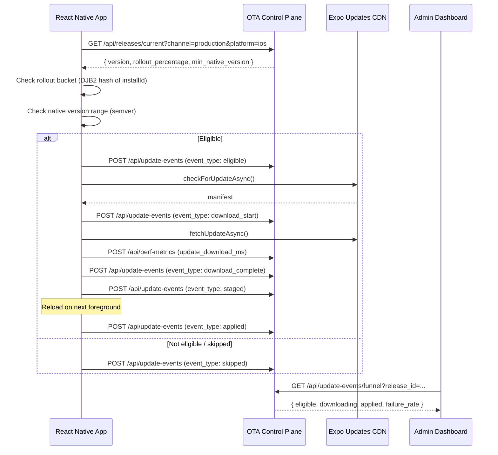
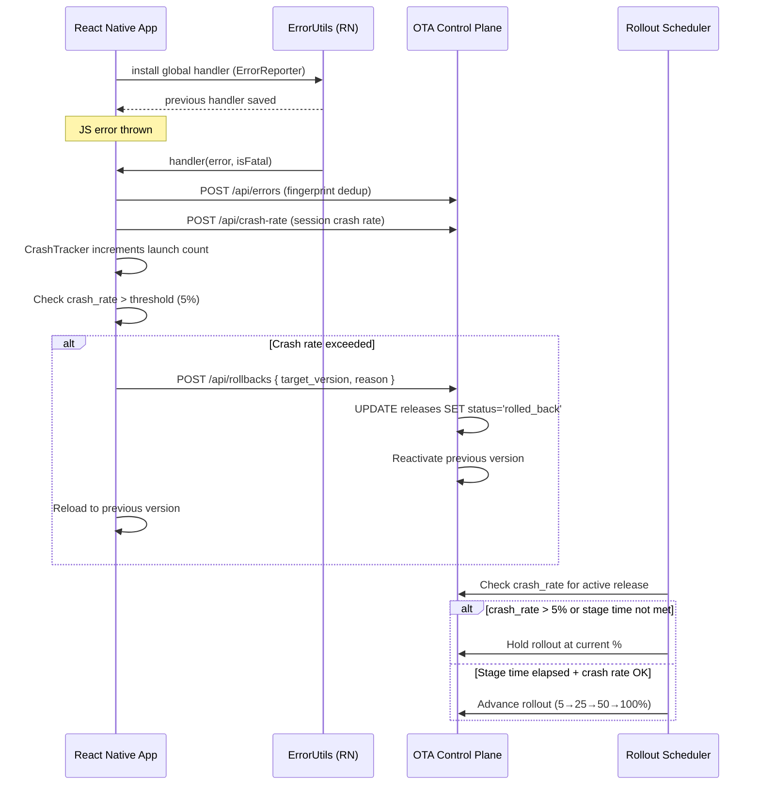
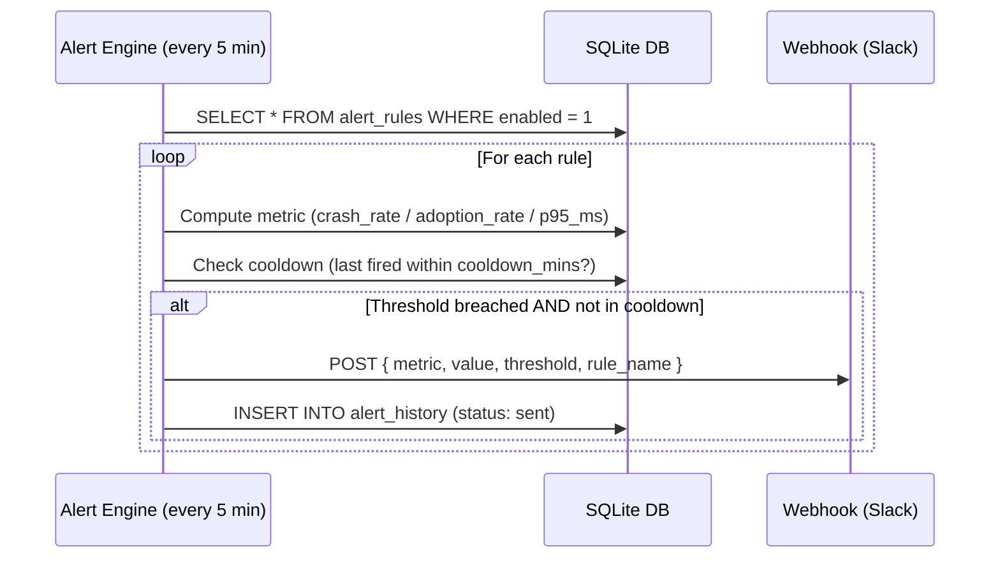
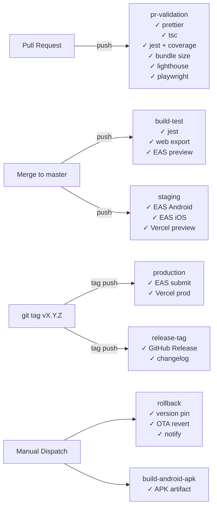

# System Architecture

## High-Level Overview

---

## Data Flow: OTA Update Lifecycle

---

## Data Flow: Crash Detection & Auto-Rollback

---

## Data Flow: Alert Engine

---

## Database Schema (14 Tables)

```mermaid
erDiagram
    feature_flags {
        TEXT id PK
        TEXT key UK
        INTEGER enabled
        TEXT targeting
        TEXT created_at
        TEXT updated_at
    }
    experiments {
        TEXT id PK
        TEXT key UK
        TEXT status
        TEXT variants
        TEXT targeting
    }
    experiment_assignments {
        TEXT install_id PK
        TEXT experiment_id PK
        TEXT variant_id
    }
    dynamic_urls {
        TEXT id PK
        TEXT key UK
        TEXT value
        TEXT targeting
    }
    kill_switches {
        TEXT id PK
        TEXT key UK
        INTEGER active
        TEXT reason
    }
    releases {
        TEXT id PK
        TEXT version
        TEXT channel
        TEXT platform
        REAL rollout_percentage
        TEXT status
        TEXT min_native_version
        TEXT max_native_version
    }
    rollbacks {
        TEXT id PK
        TEXT target_version
        TEXT from_version
        TEXT reason
        TEXT channels
        TEXT status
    }
    crash_rates {
        TEXT id PK
        REAL crash_rate
        TEXT version
        TEXT channel
        TEXT recorded_at
    }
    perf_metrics {
        TEXT id PK
        TEXT device_id
        TEXT version
        TEXT metric_type
        REAL value
        TEXT recorded_at
    }
    update_events {
        TEXT id PK
        TEXT device_id
        TEXT release_id
        TEXT event_type
        TEXT error_msg
        TEXT recorded_at
    }
    alert_rules {
        TEXT id PK
        TEXT name
        TEXT metric
        TEXT operator
        REAL threshold
        TEXT webhook_url
        INTEGER enabled
    }
    alert_history {
        TEXT id PK
        TEXT rule_id FK
        REAL metric_value
        TEXT status
        TEXT fired_at
    }
    error_groups {
        TEXT id PK
        TEXT fingerprint UK
        TEXT error_type
        INTEGER event_count
        TEXT status
    }
    error_events {
        TEXT id PK
        TEXT group_id FK
        TEXT device_id
        TEXT stack_trace
        TEXT recorded_at
    }
    audit_log {
        TEXT id PK
        TEXT entity_type
        TEXT entity_id
        TEXT action
        TEXT changes
    }

    alert_history }o--|| alert_rules : "rule_id"
    error_events }o--|| error_groups : "group_id"
    experiment_assignments }o--|| experiments : "experiment_id"
```

---

## CI/CD Pipeline Map

